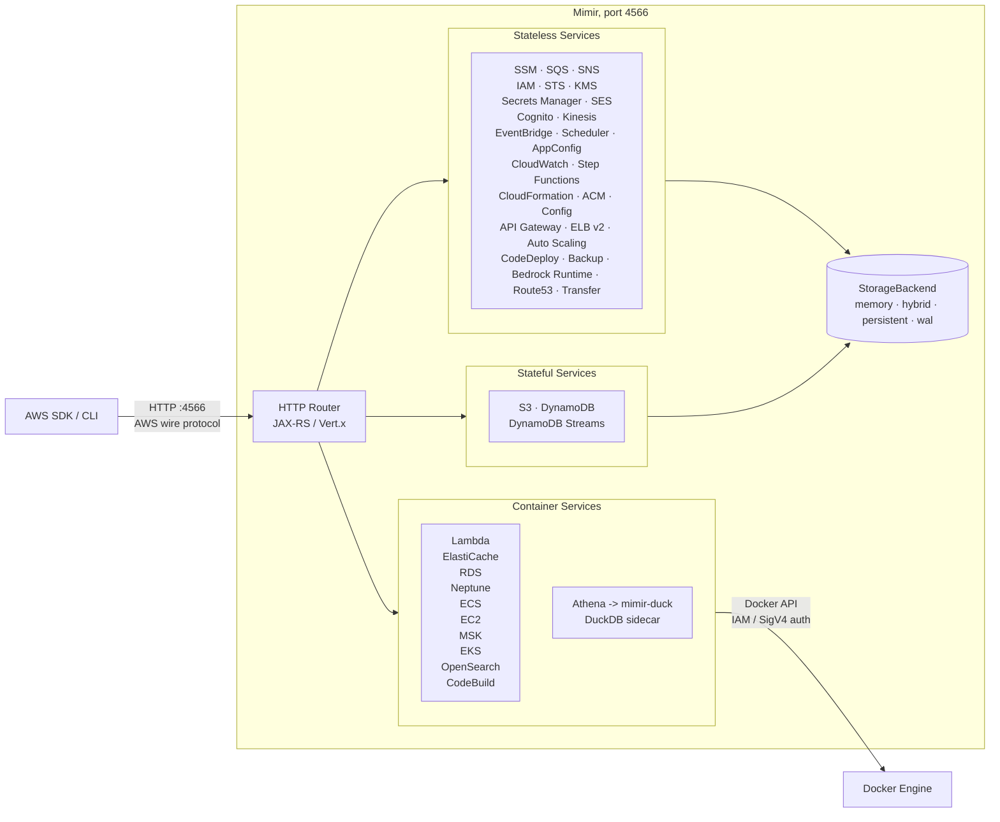

<p align="center">
  
  
</p>

<p align="center">
  <strong>Local AWS with a memory for your workflows</strong><br />
  No account. No auth token. No feature gates. Just <code>docker compose up</code>.
</p>

<p align="center">
  <a href="https://github.com/mimir-local/mimir/releases/latest"></a>
  <a href="https://github.com/mimir-local/mimir/actions/workflows/release.yml"></a>
  <a href="https://hub.docker.com/r/mimir/mimir"></a>
  <a href="https://hub.docker.com/r/mimir/mimir"></a>
  <a href="https://opensource.org/licenses/MIT"></a>
  <a href="https://github.com/mimir-local/mimir/stargazers"></a>
</p>

<p align="center">
  <a href="#quick-start">Quick Start</a> ·
  <a href="#features">Features</a> ·
  <a href="#supported-services">Services</a> ·
  <a href="#sdk-integration">SDKs</a> ·
  <a href="#testcontainers">Testcontainers</a> ·
  <a href="#migrating-from-localstack">Migration</a> ·
  <a href="https://mimir.local/mimir/">Docs</a>
</p>

---

## What is Mimir?

Mimir is a free, open-source local AWS emulator for development, testing, and CI.

It gives you AWS-shaped services on your machine without requiring a cloud account, an auth token, or paid feature gates. Point your AWS SDK, CLI, Terraform, CDK, OpenTofu, or test suite at `http://localhost:4566` and keep your existing workflows.

Mimir is named for the keeper of wisdom in Norse mythology: a local emulator meant to make AWS development easier to reason about.

## Quick Start

The fastest way to run Mimir is with the official [CLI](https://github.com/mimir-local/mimir-cli)

```bash
mimir start
```

Export the AWS environment variables:

```bash
eval $(mimir env)
```

Use your existing AWS tools normally:

```bash
aws s3 mb s3://my-bucket

aws dynamodb create-table \
  --table-name demo-table \
  --attribute-definitions AttributeName=pk,AttributeType=S \
  --key-schema AttributeName=pk,KeyType=HASH \
  --billing-mode PAY_PER_REQUEST

aws dynamodb list-tables
```

### Watch it run

This short demo shows the CLI flow: start Mimir, export the local AWS environment, run standard AWS CLI commands, and stop the emulator.

https://github.com/user-attachments/assets/b55714dc-ef36-40ae-a734-cd2cadc288a8

All AWS services are available at `http://localhost:4566`. Any region works. Credentials can be any non-empty values.

<details>
<summary>Prefer Docker Compose?</summary>

Create a `compose.yaml` file:

```yaml
services:
  mimir:
    image: mimir/mimir:latest
    ports:
      - "4566:4566"
```

Start Mimir:

```bash
docker compose up
```

Then configure your AWS environment manually:

```bash
export AWS_ENDPOINT_URL=http://localhost:4566
export AWS_DEFAULT_REGION=us-east-1
export AWS_ACCESS_KEY_ID=test
export AWS_SECRET_ACCESS_KEY=test
```

</details>

<details>
<summary>Using the old <code>mimir-local/mimir</code> image?</summary>

Update your image name:

```yaml
# Before
image: mimir-local/mimir:latest

# After
image: mimir/mimir:latest
```

The old `mimir-local/mimir` repository no longer receives updates.

</details>

## Features

<details open>
<summary><strong>Local AWS without the cloud account</strong></summary>

Run AWS-compatible services locally without an AWS account, auth token, or paid feature gates.

</details>

<details>
<summary><strong>Real Docker where fidelity matters</strong></summary>

Lambda, RDS, Neptune, ElastiCache, MSK, ECS, EC2, EKS, OpenSearch, and CodeBuild use real Docker-backed execution instead of shallow mocks.

</details>

<details>
<summary><strong>Drop-in AWS compatibility</strong></summary>

Point standard AWS clients at `http://localhost:4566`. Existing credentials, regions, SDKs, CLI commands, and IaC workflows stay familiar.

</details>

<details>
<summary><strong>Fast enough for CI</strong></summary>

The native image starts in milliseconds and keeps idle memory low, making it practical for local development and test pipelines.

</details>

<details>
<summary><strong>Configurable persistence</strong></summary>

Choose from in-memory, persistent, hybrid, and write-ahead log storage depending on the durability profile you need.

</details>

## Why Mimir?

LocalStack's community edition [sunset in March 2026](https://blog.localstack.cloud/the-road-ahead-for-localstack/), requiring auth tokens and freezing security updates. Mimir is the no-strings-attached alternative.

| Capability | Mimir | LocalStack Community |
|---|:---:|:---:|
| Auth token required | No | Yes |
| Security updates | Yes | Frozen |
| Startup time | ~24 ms | ~3.3 s |
| Idle memory | ~13 MiB | ~143 MiB |
| Docker image size | ~90 MB | ~1.0 GB |
| License | MIT | Restricted |
| API Gateway v2 / HTTP API | Yes | No |
| Cognito | Yes | No |
| RDS, ElastiCache, MSK | Real Docker | No |
| Neptune (graph DB + Gremlin WebSocket) | Real Docker | No |
| ECS, EC2, EKS | Real Docker | No |
| CodeBuild | Real Docker execution | No |
| Native binary | ~40 MB | No |

**50 service aliases. Broad coverage. Free forever.**

Mimir treats coverage as a release gate, not just a service list. Before a
release, run the AWS CLI smoke suite against the image:

```bash
MIMIR_ENDPOINT=http://127.0.0.1:4566 tools/release-smoke.sh
```

The smoke suite verifies that every enabled service alias is reachable with an
AWS-shaped CLI operation. See the [coverage and release gates](https://mimir.local/mimir/services/coverage/)
page for the exact operation list and the difference between service health,
route smoke, and workflow parity.

## Architecture Overview



## Supported Services

Mimir supports local emulation for application services, data services, eventing, identity, infrastructure, billing, and container-backed workloads.

| Category | Services |
|---|---|
| Core app services | S3, SQS, SNS, DynamoDB, Lambda, IAM, STS, KMS, Secrets Manager |
| Events and workflows | EventBridge, EventBridge Pipes, EventBridge Scheduler, Step Functions, CloudWatch Logs, CloudWatch Metrics |
| API and identity | API Gateway REST, API Gateway v2, Cognito, ACM, Route53 |
| Containers and compute | ECS, EC2, EKS, CodeBuild, CodeDeploy, Auto Scaling, ELB v2 |
| Graph database | Neptune |
| Data and analytics | Athena, Glue, Firehose, OpenSearch, Textract |
| Messaging and transfer | SES, SES v2, Kinesis, Transfer Family |
| Cost and billing | Pricing, Cost Explorer, Cost and Usage Reports, BCM Data Exports |
| Backup and config | AWS Backup, AWS Config, AppConfig, AppConfigData, CloudFormation |

For operation-level compatibility, see the [Services Overview](https://mimir.local/mimir/services/)
and [Coverage and Release Gates](https://mimir.local/mimir/services/coverage/).

<details>
<summary>Detailed service notes</summary>

| Service | How it works | Notable features |
|---|---|---|
| SSM Parameter Store | In-process | Version history, labels, SecureString, tagging |
| SSM Run Command | In-process | SendCommand, GetCommandInvocation, ListCommands, CancelCommand, agent polling via ec2messages |
| SQS | In-process | Standard and FIFO queues, DLQ, visibility timeout, batch operations, tagging |
| SNS | In-process | Topics, subscriptions, SQS, Lambda and HTTP delivery, tagging |
| S3 | In-process | Versioning, multipart upload, pre-signed URLs, Object Lock, event notifications |
| DynamoDB | In-process | GSI, LSI, Query, Scan, TTL, transactions, batch operations |
| DynamoDB Streams | In-process | Shard iterators, records, Lambda event source mapping trigger |
| Lambda | Real Docker | Runtime environment, execution model, warm container pool, aliases, Function URLs |
| API Gateway REST | In-process | Resources, methods, stages, Lambda proxy, MOCK integrations, AWS integrations |
| API Gateway v2 | In-process | HTTP APIs, routes, integrations, JWT authorizers, stages |
| IAM | In-process | Users, roles, groups, policies, instance profiles, access keys |
| STS | In-process | AssumeRole, WebIdentity, SAML, GetFederationToken, GetSessionToken |
| Cognito | In-process | User pools, app clients, auth flows, JWKS and OpenID well-known endpoints |
| KMS | In-process | Encrypt, decrypt, sign, verify, data keys, aliases |
| Kinesis | In-process | Streams, shards, enhanced fan-out, split and merge |
| Secrets Manager | In-process | Versioning, resource policies, tagging |
| Step Functions | In-process | ASL execution, task tokens, execution history |
| CloudFormation | In-process | Stacks, change sets, resource provisioning |
| EventBridge | In-process | Custom buses, rules, SQS, SNS and Lambda targets |
| EventBridge Pipes | In-process | Poller-based integration connecting SQS, Kinesis, DynamoDB, and MSK sources to targets with optional filtering |
| EventBridge Scheduler | In-process | Schedule groups, schedules, flexible time windows, retry policies, DLQs |
| CloudWatch Logs | In-process | Log groups, streams, ingestion, filtering |
| CloudWatch Metrics | In-process | Custom metrics, statistics, alarms |
| ElastiCache | Real Docker | Redis / Valkey protocol, IAM auth, SigV4 validation |
| RDS | Real Docker | PostgreSQL, MySQL, MariaDB, IAM auth, JDBC-compatible engines |
| Neptune | Real Docker | Graph DB via TinkerPop Gremlin Server; RDS-shaped control plane; Gremlin WebSocket on port 8182 with SigV4 proxy |
| MSK | Real Docker | Kafka-compatible broker via Redpanda |
| Athena | In-process with DuckDB sidecar | Real SQL execution over S3 and Glue-backed views |
| Glue | In-process | Data Catalog, Schema Registry, tables consumed by Athena |
| Data Firehose | In-process | Streaming delivery, NDJSON flush to S3 |
| ECS | Real Docker | Clusters, task definitions, tasks, services, capacity providers, task sets |
| EC2 | Real Docker | RunInstances launches containers, SSH key injection, UserData, IMDS, VPC resources |
| ACM | In-process | Certificate issuance and validation lifecycle |
| ECR | In-process with real registry | Repositories, docker push / pull, image-backed Lambda functions |
| SES | In-process | Send email, raw email, identity verification, DKIM, templates |
| SES v2 | In-process | REST JSON API, identities, DKIM, account sending, templates |
| OpenSearch | Real Docker | Domain CRUD, tags, versions, instance types, upgrade stubs |
| AppConfig | In-process | Applications, environments, profiles, hosted versions, deployments |
| AppConfigData | In-process | Configuration sessions and dynamic configuration retrieval |
| Bedrock Runtime | In-process stub | Dummy Converse and InvokeModel responses for local development |
| EKS | Real Docker, mock mode available | k3s clusters with live Kubernetes API server |
| ELB v2 | In-process | ALB, NLB, target groups, listeners, routing rules, Lambda targets, tags |
| CodeBuild | In-process with real Docker | Real buildspec execution, CloudWatch logs, S3 artifacts |
| CodeDeploy | In-process with Lambda traffic shifting | Deployment groups, configs, lifecycle hooks, auto-rollback |
| Auto Scaling | In-process with reconciler | Launch configs, ASGs, desired capacity reconciliation, lifecycle hooks |
| AWS Backup | In-process | Vaults, backup plans, selections, simulated job lifecycle, recovery points |
| AWS Config | In-process | Config rules, configuration recorders, delivery channels, conformance packs, tagging |
| Route53 | In-process | Hosted zones, SOA and NS records, resource record sets, change tracking, tagging |
| Transfer Family | In-process | Server lifecycle, user management, SSH key import, tagging |
| Textract | In-process stub | API-compatible stubs, dummy block data, async job simulation |
| Pricing | In-process with static snapshot | Product discovery, attributes, price list files, pagination |
| Cost Explorer | In-process | Cost synthesized from Mimir resource state and pricing snapshots |
| Cost and Usage Reports | In-process with mimir-duck sidecar | CUR 2.0 and FOCUS 1.2 columns, account-scoped storage, Parquet emission |
| BCM Data Exports | In-process | Export lifecycle, executions, update and delete operations |

</details>

## Real Docker Integration

Mimir uses real Docker containers when in-process emulation would reduce fidelity. This applies to stateful databases, connection-heavy protocols, runtimes, and build systems.

| Service | Default image | What is real |
|---|---|---|
| Lambda | `public.ecr.aws/lambda/<runtime>` | AWS runtime environment, execution model, warm container pool |
| ElastiCache | `valkey/valkey:8` | Redis / Valkey protocol, ACL-based IAM auth, SigV4 validation |
| RDS PostgreSQL | `postgres:16-alpine` | PostgreSQL engine, IAM auth, JDBC-compatible access |
| RDS MySQL / Aurora | `mysql:8.0` | MySQL engine, IAM auth, JDBC-compatible access |
| RDS MariaDB | `mariadb:11` | MariaDB engine, IAM auth, JDBC-compatible access |
| Neptune | `tinkerpop/gremlin-server:3.7.3` | TinkerPop Gremlin Server; Gremlin WebSocket on port 8182; SigV4 auth proxy |
| MSK | `redpandadata/redpanda:latest` | Kafka-compatible broker via Redpanda |
| EC2 | AMI-mapped Linux images | Linux containers, SSH key injection, UserData, IMDS, IAM credentials |
| ECS | User-specified task image | Container lifecycle, start, stop, health checks |
| EKS | `rancher/k3s:latest` | Kubernetes API server via k3s |
| CodeBuild | User-specified environment image | Buildspec execution, log streaming, S3 artifact upload |
| OpenSearch | `opensearchproject/opensearch:2` | Full OpenSearch engine with REST API |
| ECR | `registry:2` | OCI-compatible registry for docker push and docker pull |

Docker-backed services require the Docker socket:

```bash
docker run -d --name mimir \
  -p 4566:4566 \
  -v /var/run/docker.sock:/var/run/docker.sock \
  -u root \
  mimir/mimir:latest
```

### Overriding default images

| Variable | Default |
|---|---|
| `MIMIR_SERVICES_ELASTICACHE_DEFAULT_IMAGE` | `valkey/valkey:8` |
| `MIMIR_SERVICES_RDS_DEFAULT_POSTGRES_IMAGE` | `postgres:16-alpine` |
| `MIMIR_SERVICES_RDS_DEFAULT_MYSQL_IMAGE` | `mysql:8.0` |
| `MIMIR_SERVICES_RDS_DEFAULT_MARIADB_IMAGE` | `mariadb:11` |
| `MIMIR_SERVICES_MSK_DEFAULT_IMAGE` | `redpandadata/redpanda:latest` |
| `MIMIR_SERVICES_OPENSEARCH_DEFAULT_IMAGE` | `opensearchproject/opensearch:2` |
| `MIMIR_SERVICES_NEPTUNE_DEFAULT_IMAGE` | `tinkerpop/gremlin-server:3.7.3` |
| `MIMIR_SERVICES_EKS_DEFAULT_IMAGE` | `rancher/k3s:latest` |
| `MIMIR_SERVICES_ECR_REGISTRY_IMAGE` | `registry:2` |
| `MIMIR_ECR_BASE_URI` | `public.ecr.aws` |

## Persistence and Storage Modes

Mimir can trade speed for durability depending on the workflow. Configure the default mode with `MIMIR_STORAGE_MODE`, or override storage per service.

| Mode | Behavior | Best for | Durability |
|---|---|---|:---:|
| `memory` | Entirely in RAM. Data is lost when the container stops. | CI and ephemeral tests | None |
| `persistent` | Loaded at startup and flushed to disk immediately on every write operation. | Simple local state preservation with immediate persistence | Medium |
| `hybrid` | In-memory performance with periodic async flushing every 5 seconds. | Local development | Good |
| `wal` | Write-ahead log. Every mutation is logged before responding. | Maximum durability | Highest |

Use `memory` for fast test runs. Use `hybrid` when you want state preserved across container restarts without much overhead.

For more detail, see the [Storage Configuration documentation](https://mimir.local/mimir/configuration/storage/).

## Multi-Account Isolation

Mimir supports per-account resource isolation with no extra setup. If `AWS_ACCESS_KEY_ID` is exactly 12 digits, Mimir uses it as the account ID. Resources created by one account are invisible to another.

```bash
AWS_ACCESS_KEY_ID=111111111111 aws sqs create-queue --queue-name orders
AWS_ACCESS_KEY_ID=222222222222 aws sqs create-queue --queue-name orders
```

Any other key format, such as `test` or `AKIA...`, causes Mimir to fall back to `MIMIR_DEFAULT_ACCOUNT_ID`, which defaults to `000000000000`.

See the [Multi-Account Isolation docs](https://mimir.local/mimir/configuration/multi-account/).

## SDK Integration

Point your existing AWS SDK at `http://localhost:4566`.

<details>
<summary><strong>Java, AWS SDK v2</strong></summary>

```java
var client = DynamoDbClient.builder()
    .endpointOverride(URI.create("http://localhost:4566"))
    .region(Region.US_EAST_1)
    .credentialsProvider(StaticCredentialsProvider.create(
        AwsBasicCredentials.create("test", "test")))
    .build();

client.createTable(b -> b
    .tableName("demo-table")
    .billingMode(BillingMode.PAY_PER_REQUEST)
    .attributeDefinitions(
        AttributeDefinition.builder().attributeName("pk").attributeType(ScalarAttributeType.S).build())
    .keySchema(
        KeySchemaElement.builder().attributeName("pk").keyType(KeyType.HASH).build()));

System.out.println(client.listTables().tableNames());
```

</details>

<details>
<summary><strong>Python, boto3</strong></summary>

```python
import boto3

client = boto3.client(
    "ssm",
    endpoint_url="http://localhost:4566",
    region_name="us-east-1",
    aws_access_key_id="test",
    aws_secret_access_key="test",
)

client.put_parameter(
    Name="/demo/app/message",
    Value="hello from mimir",
    Type="String",
    Overwrite=True,
)

response = client.get_parameter(Name="/demo/app/message")
print(response["Parameter"]["Value"])
```

</details>

<details>
<summary><strong>Node.js, AWS SDK v3</strong></summary>

```javascript
import { SQSClient, SendMessageCommand } from "@aws-sdk/client-sqs";

const client = new SQSClient({
  endpoint: "http://localhost:4566",
  region: "us-east-1",
  credentials: { accessKeyId: "test", secretAccessKey: "test" },
});

await client.send(
  new SendMessageCommand({
    QueueUrl: "http://localhost:4566/000000000000/demo-queue",
    MessageBody: "hello from mimir",
  }),
);
```

</details>

<details>
<summary><strong>Go, AWS SDK v2</strong></summary>

```go
package main

import (
    "context"
    "fmt"
    "log"

    "github.com/aws/aws-sdk-go-v2/config"
    "github.com/aws/aws-sdk-go-v2/credentials"
    "github.com/aws/aws-sdk-go-v2/service/s3"
)

func main() {
    cfg, err := config.LoadDefaultConfig(context.TODO(),
        config.WithRegion("us-east-1"),
        config.WithCredentialsProvider(
            credentials.NewStaticCredentialsProvider("test", "test", ""),
        ),
        config.WithBaseEndpoint("http://localhost:4566"),
    )
    if err != nil {
        log.Fatal(err)
    }

    client := s3.NewFromConfig(cfg, func(o *s3.Options) {
        o.UsePathStyle = true
    })

    out, err := client.ListBuckets(context.TODO(), nil)
    if err != nil {
        log.Fatal(err)
    }

    fmt.Println(out.Buckets)
}
```

</details>

<details>
<summary><strong>Rust, AWS SDK</strong></summary>

```rust
use aws_sdk_secretsmanager::config::{Credentials, Region};
use aws_sdk_secretsmanager::Client;

#[tokio::main]
async fn main() -> Result<(), Box<dyn std::error::Error>> {
    let config = aws_config::defaults(aws_config::BehaviorVersion::latest())
        .region(Region::new("us-east-1"))
        .credentials_provider(Credentials::new("test", "test", None, None, "mimir"))
        .endpoint_url("http://localhost:4566")
        .load()
        .await;

    let client = Client::new(&config);

    client
        .create_secret()
        .name("demo/secret")
        .secret_string("hello from mimir")
        .send()
        .await?;

    Ok(())
}
```

</details>

<details>
<summary><strong>Bash, AWS CLI</strong></summary>

```bash
export AWS_ACCESS_KEY_ID=test
export AWS_SECRET_ACCESS_KEY=test
export AWS_DEFAULT_REGION=us-east-1

aws --endpoint-url http://localhost:4566 s3 mb s3://my-bucket
aws --endpoint-url http://localhost:4566 s3 ls
```

</details>

## Testcontainers

Mimir has Testcontainers modules for starting isolated Mimir instances directly from tests. This avoids shared state, manual daemon setup, and port conflicts.

| Language | Package | Latest | Registry | Source |
|---|---|---|---|---|
| Java | `io.mimir:testcontainers-mimir` | `1.4.0` | [Maven Central](https://mvnrepository.com/artifact/io.mimir/testcontainers-mimir) | [GitHub](https://github.com/mimir-io/testcontainers-mimir) |
| Node.js | `@mimir/testcontainers` | `0.1.0` | [npm](https://www.npmjs.com/package/@mimir/testcontainers) | [GitHub](https://github.com/mimir-io/testcontainers-mimir-node) |
| Python | `testcontainers-mimir` | `0.1.1` | [PyPI](https://pypi.org/project/testcontainers-mimir/) | [GitHub](https://github.com/mimir-io/testcontainers-mimir-python) |
| Go | In progress | In progress | N/A | [GitHub](https://github.com/mimir-io/testcontainers-mimir-go) |

<details>
<summary><strong>Java</strong></summary>

```xml
<dependency>
    <groupId>io.mimir</groupId>
    <artifactId>testcontainers-mimir</artifactId>
    <version>1.4.0</version>
    <scope>test</scope>
</dependency>
```

```java
@Testcontainers
class S3IntegrationTest {

    @Container
    static MimirContainer mimir = new MimirContainer();

    @Test
    void shouldCreateBucket() {
        S3Client s3 = S3Client.builder()
                .endpointOverride(URI.create(mimir.getEndpoint()))
                .region(Region.of(mimir.getRegion()))
                .credentialsProvider(StaticCredentialsProvider.create(
                        AwsBasicCredentials.create(mimir.getAccessKey(), mimir.getSecretKey())))
                .forcePathStyle(true)
                .build();

        s3.createBucket(b -> b.bucket("my-bucket"));
    }
}
```

For Testcontainers 2.x / Spring Boot 4.x, use version `2.5.0`.

</details>

<details>
<summary><strong>Node.js / TypeScript</strong></summary>

```sh
npm install --save-dev @mimir/testcontainers
```

```ts
import { MimirContainer } from "@mimir/testcontainers";
import { S3Client, CreateBucketCommand } from "@aws-sdk/client-s3";

describe("S3", () => {
  let mimir: MimirContainer;

  beforeAll(async () => {
    mimir = await new MimirContainer().start();
  });

  afterAll(async () => {
    await mimir.stop();
  });

  it("creates a bucket", async () => {
    const s3 = new S3Client({
      endpoint: mimir.getEndpoint(),
      region: mimir.getRegion(),
      credentials: {
        accessKeyId: mimir.getAccessKey(),
        secretAccessKey: mimir.getSecretKey(),
      },
      forcePathStyle: true,
    });

    await s3.send(new CreateBucketCommand({ Bucket: "my-bucket" }));
  });
});
```

</details>

<details>
<summary><strong>Python</strong></summary>

```sh
pip install testcontainers-mimir
```

```python
import boto3
from testcontainers_mimir import MimirContainer


def test_s3_create_bucket():
    with MimirContainer() as mimir:
        s3 = boto3.client(
            "s3",
            endpoint_url=mimir.get_endpoint(),
            region_name=mimir.get_region(),
            aws_access_key_id=mimir.get_access_key(),
            aws_secret_access_key=mimir.get_secret_key(),
        )
        s3.create_bucket(Bucket="my-bucket")
```

</details>

## Compatibility Testing

The [`compatibility-tests`](./compatibility-tests/) directory validates Mimir across SDKs and tooling workflows.

| Module | Language / Tool | SDK / Client | Tests |
|---|---|---|---:|
| `sdk-test-java` | Java 17 | AWS SDK for Java v2 | 899 |
| `sdk-test-node` | Node.js | AWS SDK for JavaScript v3 | 366 |
| `sdk-test-python` | Python 3 | boto3 | 272 |
| `sdk-test-go` | Go | AWS SDK for Go v2 | 144 |
| `sdk-test-awscli` | Bash | AWS CLI v2 | 152 |
| `sdk-test-rust` | Rust | AWS SDK for Rust | 90 |
| `compat-terraform` | Terraform | v1.10+ | 14 |
| `compat-opentofu` | OpenTofu | v1.9+ | 14 |
| `compat-cdk` | AWS CDK | v2+ | 17 |

**1,968 automated compatibility tests across 6 SDKs and 3 IaC tools.**

## Migrating from LocalStack

Mimir is a drop-in replacement for LocalStack Community. The port, credentials, SDK configuration, and CLI endpoint pattern work the same way. Swap the image and keep going.

```yaml
# Before
image: localstack/localstack

# After, standard image
image: mimir/mimir:latest

# After, if init scripts need AWS CLI or boto3
image: mimir/mimir:latest-compat
```

LocalStack environment variables are translated automatically:

| LocalStack | Mimir equivalent |
|---|---|
| `LOCALSTACK_HOST` | `MIMIR_HOSTNAME` |
| `PERSISTENCE=1` | `MIMIR_STORAGE_MODE=persistent` |
| `LAMBDA_DOCKER_NETWORK` | `MIMIR_SERVICES_LAMBDA_DOCKER_NETWORK` |
| `LAMBDA_REMOVE_CONTAINERS=1` | `MIMIR_SERVICES_LAMBDA_EPHEMERAL=true` |
| `DEBUG=1` | `QUARKUS_LOG_LEVEL=DEBUG` |

Init scripts mounted under `/etc/localstack/init/` run unchanged. The `/_localstack/init` and `/_localstack/health` endpoints are still served. Set `LOCALSTACK_PARITY=false` to opt out of automatic translation.

See the [full migration guide](https://mimir.local/mimir/getting-started/migrate-from-localstack/).

## Image Tags

Every tag combines a variant and a channel.

| Channel | Standard | Compat with AWS CLI and boto3 |
|---|---|---|
| Release, floating | `latest` | `latest-compat` |
| Release, pinned | `x.y.z` | `x.y.z-compat` |
| Nightly, floating | `nightly` | `nightly-compat` |
| Nightly, dated | `nightly-mmddyyyy` | `nightly-mmddyyyy-compat` |

Use `latest` for stable releases, a pinned version for reproducible builds, and `nightly` to track `main`.

```yaml
# Recommended
image: mimir/mimir:latest

# Includes AWS CLI and boto3
image: mimir/mimir:latest-compat

# Pinned release
image: mimir/mimir:1.5.11

# Track main
image: mimir/mimir:nightly
```

## Configuration

All settings are overridable through environment variables with the `MIMIR_` prefix.

| Variable | Default | Description |
|---|---|---|
| `MIMIR_PORT` | `4566` | Port exposed by the Mimir API |
| `MIMIR_DEFAULT_REGION` | `us-east-1` | Default AWS region |
| `MIMIR_DEFAULT_ACCOUNT_ID` | `000000000000` | Default AWS account ID |
| `MIMIR_BASE_URL` | `http://localhost:4566` | Base URL used when Mimir returns service URLs |
| `MIMIR_HOSTNAME` | Unset | Hostname used in returned URLs when Mimir runs inside Docker Compose |
| `MIMIR_STORAGE_MODE` | `memory` | Storage mode: `memory`, `persistent`, `hybrid`, or `wal` |
| `MIMIR_STORAGE_PERSISTENT_PATH` | `./data` | Directory used for persisted state |
| `MIMIR_ECR_BASE_URI` | `public.ecr.aws` | ECR base URI used when pulling container images |

Full reference: [configuration docs](https://mimir.local/mimir/configuration/advanced/application-yml)

### Multi-container Docker Compose

When your application runs in a different container, set `MIMIR_HOSTNAME` to the Mimir service name so returned URLs, such as SQS `QueueUrl` values, resolve correctly.

```yaml
services:
  mimir:
    image: mimir/mimir:latest
    ports:
      - "4566:4566"
    environment:
      - MIMIR_HOSTNAME=mimir

  my-app:
    environment:
      - AWS_ENDPOINT_URL=http://mimir:4566
    depends_on:
      - mimir
```

Without this, services may return URLs using `localhost`, which points to the wrong container from the application container.

## Community

Join the Mimir community on [Slack](https://join.slack.com/t/mimir/shared_invite/zt-3tjn02s3q-A00kEjJ1cZxsg_imTfy6Cw) or [GitHub Discussions](https://github.com/orgs/mimir-io/discussions). Feature ideas, compatibility questions, design tradeoffs, and rough proposals are welcome.

## Star History

<p align="center">
  <a href="https://www.star-history.com/?repos=mimir-io%2Fmimir&type=date&legend=top-left">
    <picture>
      <source media="(prefers-color-scheme: dark)" srcset="https://api.star-history.com/chart?repos=mimir-local/mimir&type=date&theme=dark&legend=top-left" />
      <source media="(prefers-color-scheme: light)" srcset="https://api.star-history.com/chart?repos=mimir-local/mimir&type=date&legend=top-left" />
      
    </picture>
  </a>
</p>

## Contributors

<a href="https://github.com/mimir-local/mimir/graphs/contributors">
  
</a>

## License

MIT. Use it however you want.
